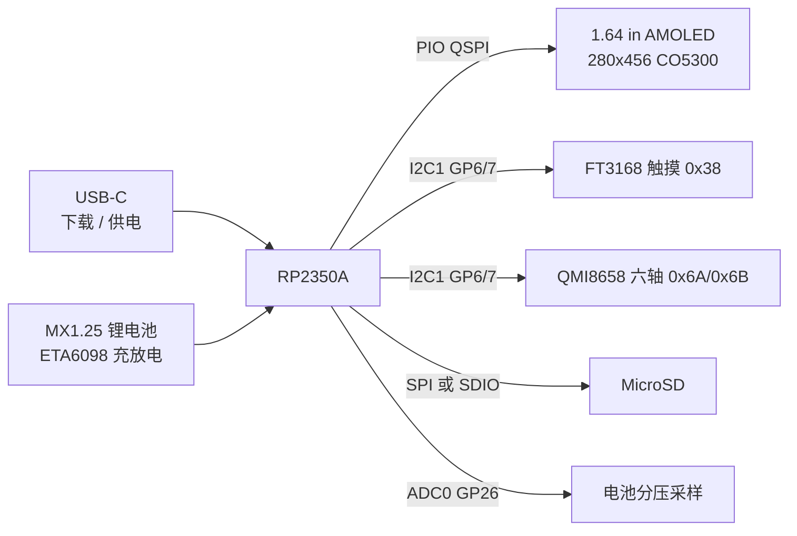

# RP2350-Touch-AMOLED-1.64 一起拆

微雪这块板看起来像一块小手机屏，底下其实是 Raspberry Pi 的 **RP2350A**：双 Cortex-M33 或双 Hazard3 RISC-V，最高 150 MHz，520 KB SRAM，外挂 **W25Q128 16 MB Flash**。型号是 `RP2350-Touch-AMOLED-1.64-M`（SKU 31337），预焊排针。

本仓库把官方例程和原理图对过一遍，整理成引脚表和第一轮上电探测脚本。屏幕驱动本身仍走微雪官方 zip，这里不复制那套代码。

## 这块板实际有什么

| 子系统 | 芯片 / 规格 | 总线 | 备注 |
| --- | --- | --- | --- |
| MCU | RP2350A，双核双架构，150 MHz | — | 板载 BOOT / RST |
| 屏幕 | 1.64" AMOLED，280×456，16.7M 色，350 cd/m²，对比度 60000:1 | PIO QSPI | 驱动 IC **CO5300**，没有 DC 脚 |
| 触摸 | **FT3168** | I2C `0x38` | 支持点按和手势（双击 / 滑动） |
| IMU | **QMI8658** 三轴加速 + 三轴陀螺 | I2C `0x6A` 或 `0x6B` | WhoAmI 期望 `0x05` |
| 存储 | W25Q128 16 MB + MicroSD | QSPI Flash / SPI·SDIO | Flash 走芯片专用 QSPI，和屏幕 QSPI 不是同一组脚 |
| 电源 | Type-C + MX1.25 单节锂电 | ETA6098 | 可边充边用，红灯充电、绿灯电源 |
| 扩展 | 双排 11 针，共 17 个 GPIO | UART / I2C / ADC / PWM / PIO | GP6/7、GP4、GP21/22 和板载外设重叠 |

产品页写了 RTC。对照原理图时没看到独立 RTC 芯片，先当宣传复用，实机再确认。

## 引脚（官方例程）

数字来自官方丝印图和微雪例程包（`DEV_Config.h`、`qspi_pio.h`、FatFs `hw_config.c`、`Python/01-SD/boot.py`）。完整排针表在 [`docs/pinout.md`](docs/pinout.md)，常量在 [`board/pins.py`](board/pins.py) / [`board/pins.h`](board/pins.h)。

### 屏幕 QSPI（PIO 模拟，不是硬件 QSPI）

| 信号 | GPIO | 说明 |
| --- | --- | --- |
| CS | 9 | 片选 |
| SCLK | 10 | 时钟 |
| D0–D3 | 11–14 | 四线数据 |
| RST | 15 | 复位 |
| PWR_EN | 未接 | 官方宏是 `-1` |

整屏 RGB565 大约 `280 × 456 × 2 ≈ 250 KB`。官方 LVGL 例程用 **PIO + DMA** 往 QSPI FIFO 灌像素，刷屏时 CPU 占用可以压到一半以下。普通 SPI 库（TFT_eSPI 一类）对这块屏基本用不了：CO5300 这条链路是 QSPI。

### I2C1 共享总线

| 信号 | GPIO |
| --- | --- |
| SDA | 6 |
| SCL | 7 |
| FT3168 INT | 4 |
| FT3168 RST | 未接 |
| QMI8658 INT1 | 8 |

触摸和 IMU 共总线，官方代码里用 `i2c_lock` 互斥。LVGL 例程把触摸轮询丢到 **core1**。

### MicroSD

SPI 模式（MicroPython 例程）：

| 信号 | GPIO |
| --- | --- |
| SCK | 18 |
| MOSI | 19 |
| MISO | 20 |
| CS | 23 |

SDIO 模式（C FatFs 例程）在同一组脚上扩成 4-bit：CLK=18，CMD=19，D0–D3=20–23。其中 **GP21 / GP22 也在排针上**，只有走四线 SD 时才被占住；SPI 挂卡时这两脚还能用。

### 电池

原理图是 **ETA6098** + `BAT_ADC` 分压。ADC 脚按 RP2350A 的 ADC0 落到 **GP26**（GP27–29 被引出，GP26 没有）。官方 LCD demo 里的换算是 `3.3 / 4096 * 3`，也就是三分压。没接电池、只靠 USB 时读数接近 0 或供电轨，属正常。

## 第一次上电

1. USB-C 接电脑。要进下载盘：按住 **BOOT**，点一下 **RST**，再松 BOOT。会出现 `RP2350` 盘。
2. **MicroPython**：官方包里有定制固件 `Python/uf2/WAVESHARE_RP2350_TOUCH_AMOLED_1_64.uf2`。Wiki 写明：不要直接刷 MicroPython 官网的普通 Pico 2 固件，可能认不到设备。
3. **C / Arduino**：用 Pico VS Code 扩展或 arduino-pico，板型选 Pico 2 / RP2350A。官方 C 例程已经带编译好的 `01-LCD.uf2`。
4. 进 Thonny 后先跑 [`examples/micropython/i2c_scan.py`](examples/micropython/i2c_scan.py)，再跑 [`examples/micropython/probe_board.py`](examples/micropython/probe_board.py)。应该能看到 `0x38` 和 `0x6A`/`0x6B`。

点亮 AMOLED、LVGL 滑动页（Logo / 六轴 / 背光滚轮）请直接用官方 zip 和 [LVGL 包](https://files.waveshare.com/wiki/RP2350-Touch-AMOLED-1.64/RP2350-Touch-AMOLED-1.64-LVGL.zip)。本仓库的脚本故意不碰 QSPI，避免半吊子初始化把屏点花。

## 接下来可以做什么

- 用官方 LVGL 当壳，把 IMU 和电池电压做成一块口袋仪表。
- MicroPython 先把 SD + 触摸跑通，UI 再迁 C。
- 试 RP2350 的 RISC-V 核：Pico SDK 选 Hazard3 工具链即可，外设脚位不变。
- 杜邦线优先用 `HEADER_SAFE_GPIO`：`0 1 2 3 5 16 17 21 22 24 25 27 28 29`。别动 GP6/7（I2C）和 GP4（触摸 INT）。
- 扩展脚注意避开 QSPI 的 GP9–15。

资料链接集中在 [`docs/resources.md`](docs/resources.md)。
