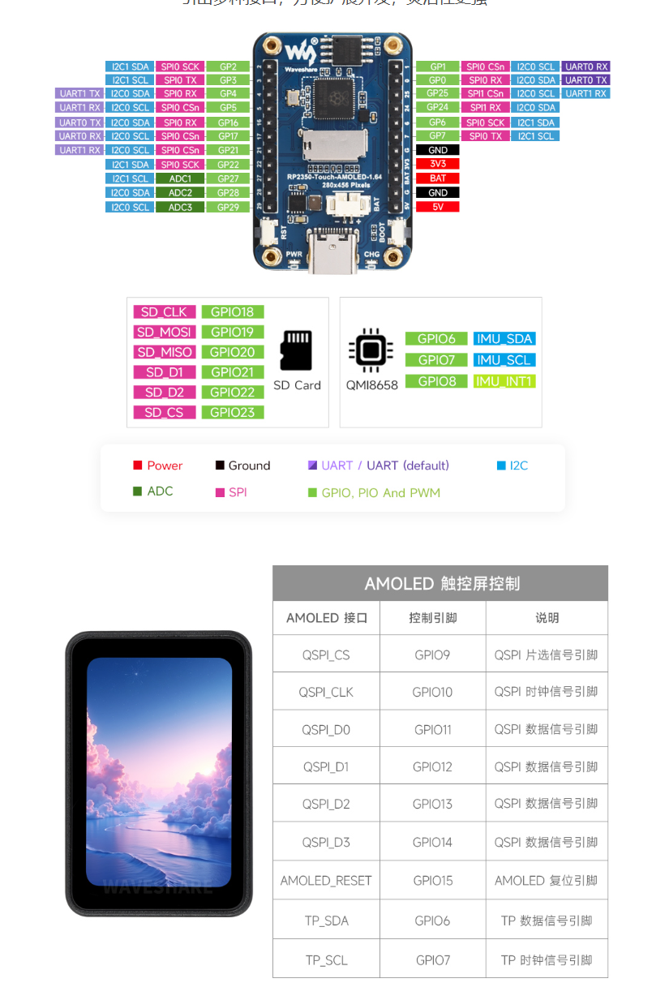

# 排针与板载占用

来源：微雪官方丝印图（[`pinout.png`](pinout.png)）+ 官方例程脚位。USB-C 在上，看排针这一面。

## 左右两排（各 11 针）

左边从上到下：

| GPIO | 默认可复用 | 板载占用 |
| --- | --- | --- |
| GP29 | ADC3, I2C0 SCL | — |
| GP28 | ADC2, I2C0 SDA | — |
| GP27 | ADC1, I2C1 SCL | — |
| GP22 | SPI0 SCK, I2C1 SDA | SDIO D2（4-bit SD 才占） |
| GP21 | SPI0 CSn, I2C0 SCL, UART1 RX | SDIO D1（4-bit SD 才占） |
| GP17 | SPI0 CSn, I2C0 SCL, UART0 RX | — |
| GP16 | SPI0 RX, I2C0 SDA, UART0 TX | — |
| GP5 | SPI0 CSn, I2C0 SCL, UART1 RX | — |
| GP4 | SPI0 RX, I2C0 SDA, UART1 TX | **FT3168 INT** |
| GP3 | SPI0 TX, I2C1 SCL | — |
| GP2 | SPI0 SCK, I2C1 SDA | — |

右边从上到下：

| 丝印 | 默认可复用 | 板载占用 |
| --- | --- | --- |
| GP1 | SPI0 CSn, I2C0 SCL, UART0 RX | — |
| GP0 | SPI0 RX, I2C0 SDA, UART0 TX | — |
| GP25 | SPI1 CSn, I2C0 SCL, UART1 RX | — |
| GP24 | SPI1 RX, I2C0 SDA | — |
| GP6 | SPI0 SCK, I2C1 SDA | **触摸 + IMU 的 SDA** |
| GP7 | SPI0 TX, I2C1 SCL | **触摸 + IMU 的 SCL** |
| GND | — | — |
| 3V3 | 3.3 V 输出 | — |
| BAT | 电池输入（和 MX1.25 并联） | — |
| GND | — | — |
| 5V | 5 V | — |

一共 **17 个 GPIO**，和产品页一致。GP8（IMU INT1）、GP9–15（QSPI 屏）、GP18–20/23（SD SPI）、GP26（电池 ADC）都没引出。

## 接线时别踩的坑

1. **GP6 / GP7 已经是 I2C1。** 可以往同一条总线再挂器件，不要改成 SPI0，否则触摸和六轴一起死。
2. **GP4 是触摸中断。** 排针上印着 UART1 TX，当串口用会和触摸抢脚。
3. **GP21 / GP22 只在 SDIO 四线模式被 SD 占用。** MicroPython 官方例程是 SPI（18/19/20/23），这时 21/22 可以当普通 IO。
4. **不要碰 GP9–15。** 屏幕 QSPI，没引出，也别在软件里当 GPIO 初始化。
5. 电池电压走 **GP26**，排针上的 ADC 是 GP27/28/29。

板载按键：丝印有 **PWR / RST / BOOT**，旁边是 USB-C、BAT 座和 CHG 灯。
